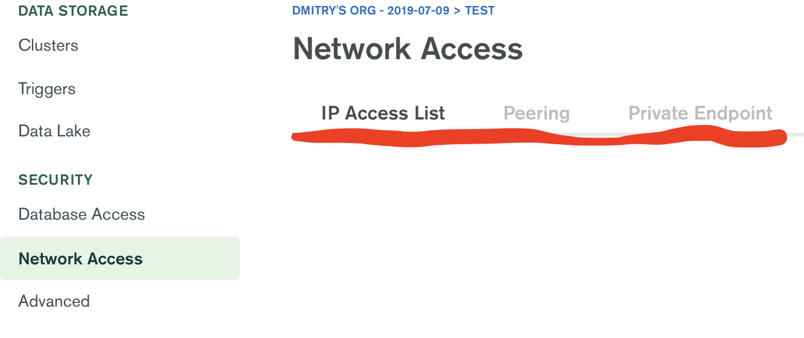
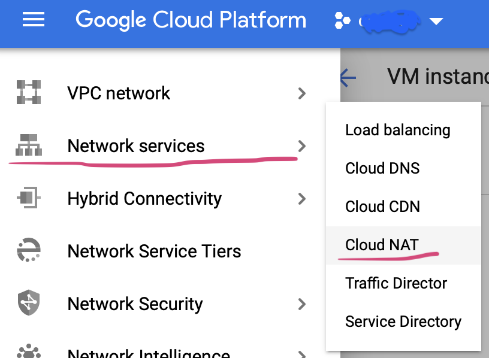
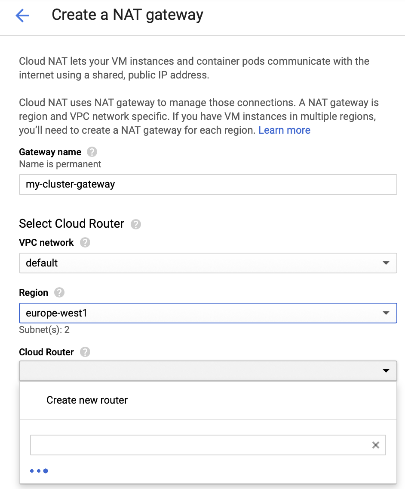
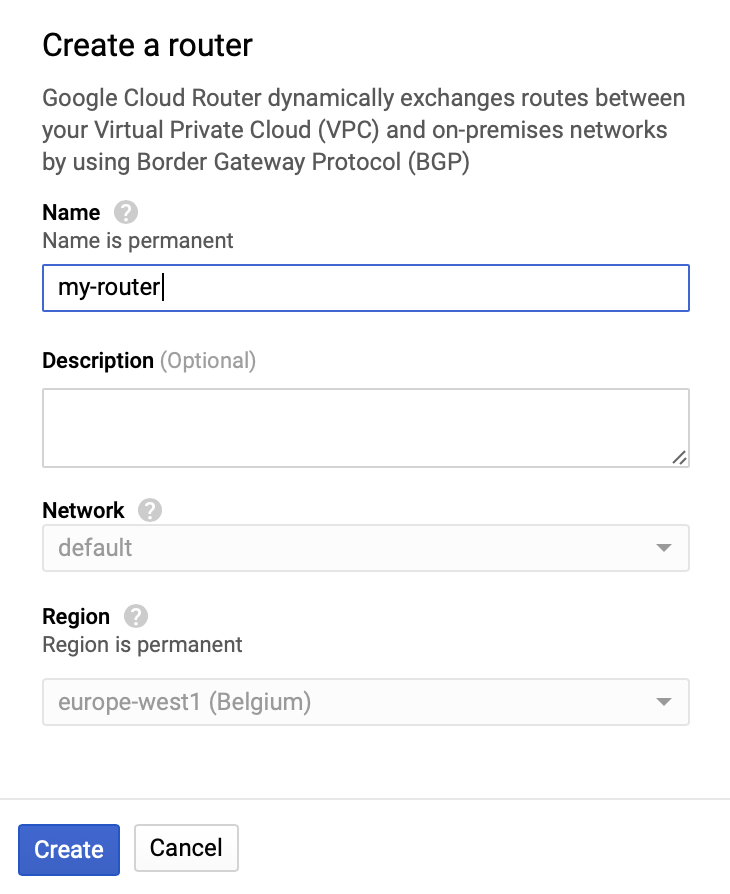
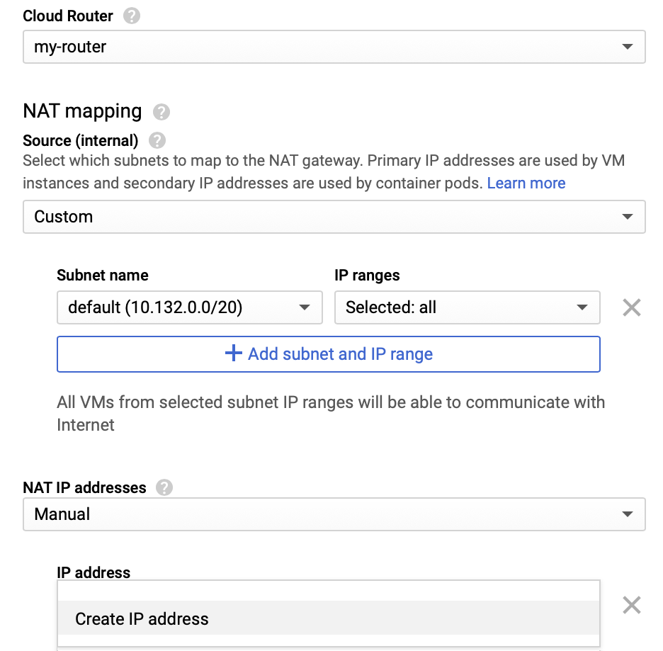
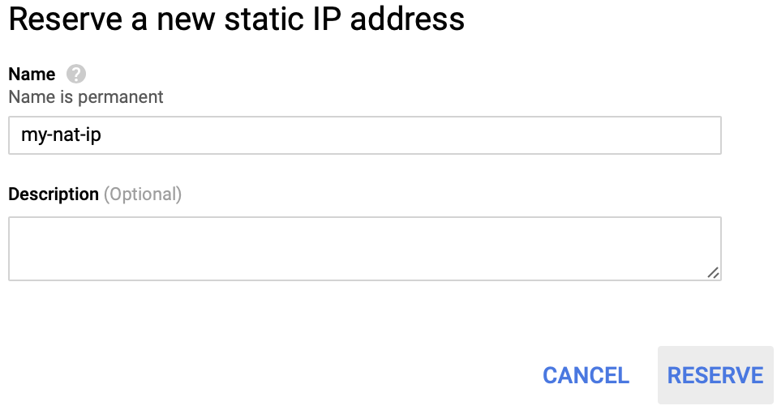
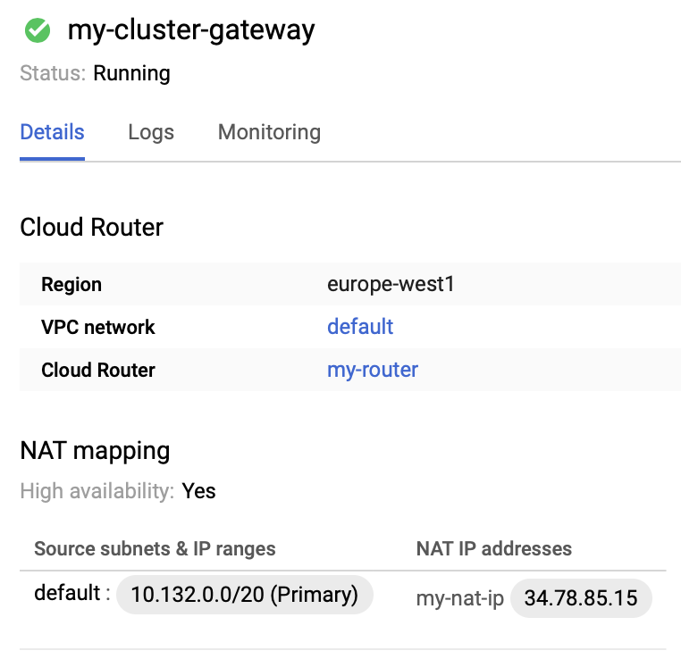

## Preface

In the [previous article](README.md) we told you about how to connect to MongoDB Atlas with Go and to interact with the database cluster. MongoDB Atlas is a cloud platform, therefore queries run through the public internet and must be very well secured. Let us go through some options we have in matters of safety and security while creating a distributed cloud infrastructure. We are going to concentrate on one particular setup, and that is a connection between a Google Kubernetes cluster and a MongoDB Atlas.

## Possible solutions

MongoDB Atlas offers three methods of securing the network:



1. `IP Access List` where you can manage static ip addresses of hosts that are allowed to connect to your database clusters. This is a very easy way to achieve the goal, especially if you want to connect a single VM (virtual machine) that has a static public IP. A good thing about this way is that you can use this setup with all tiers MongoDB Atlas offers, even with the smallest and free of charge `M0 Sandbox`.<br>
However, if you have a kubernetes cluster with several nodes, this option is almost useless. First of all, nodes of the cluster must have public ip addresses - a setup that is normally not favoured for security reasons. Secondly, the public ip of a node in the cluster is most likely to be changed at some point, and therefore MongoDB Atlas might start to refuse connections from this node.<br>
Why this option is _almost_ useless for kubernetes clusters, we'll explain below. 
2. `Peering` is very good in case you have a cluster to connect. Also pretty easy to set up. There is a [comprehensive guide](https://docs.atlas.mongodb.com/security-vpc-peering/) on how to do it. However, you must have at least `M10` cluster which is not always what you want to use. For example, we like to use several smaller MongoDB Atlas clusters, sometimes using them fleetingly and at a lower price. So, that option does not entirely meet our requirements as well.
3. `Private Endpoint` is quite the same as `Peering`, but built for AWS and works for it very well.

So, our challenge was to whitelist a Google Kubernetes Engine (GKE) cluster in MongoDB Atlas for `M2`, `M5` or even with a free of charge `M0` tier. MongoDB Atlas does not support such possibility out-of-the-box. We need to tinker around the GKE cluster.

## Big Picture

Our goal is to set up the GKE cluster so that it gets an IP address which is public and static. We use Cloud NAT for that:


Accordingly to this picture we are going to do following steps:

1. create a GKE cluster with private nodes
2. create a router and connect it with the clusters network
3. preserve a static ip address and assign it to the router
4. whitelist this ip address in Mongo DB Atlas in `IP Access List`

## Create a GKE cluster with private nodes

In any case it is a good idea to keep IP addresses of your nodes private. For the security reasons we suggest to have this setup as a best practice. However, we will make the Kubernetes API endpoint public now for the purpose of simplicity.

First, we authorize `gcloud` to access the Cloud Platform:

```sh
> gcloud config set project my-project
Updated property [core/project].

> gcloud auth activate-service-account \
    cluster-admin@my-project.iam.gserviceaccount.com \
    --key-file cluster-admin-key.json
Activated service account credentials for: [cluster-admin@my-project.iam.gserviceaccount.com]
```

_Hint: you must have a service account with the roles `Kubernetes Engine Cluster Admin` and `Compute Network Admin` as well as a key file to create a cluster. In our example we named the service account `cluster-admin` and the key `cluster-admin-key.json`_

Let us boot the cluster up:

```sh
gcloud container clusters create my-cluster \
    --enable-private-nodes \
    --enable-ip-alias \
    --master-ipv4-cidr 172.16.0.0/28 \
    --no-enable-master-authorized-networks \
    --no-enable-basic-auth \
    --no-issue-client-certificate \
    --zone europe-west1-b
```

...and explain what the parameters are good for as long as the cluster is being configured:

`--enable-private-nodes`: like it says the nodes will receive private IP addresses and will not be accessible from outside the cluster.<br>
`--enable-ip-alias`: it creates a VPC-native cluster which means setting up subnetworks that has two secondary IP ranges: one for pods and one for services.<br>
`--master-ipv4-cidr 172.16.0.0/28` specifies an internal address range for the Kubernetes management endpoints. You must declare this range, if you start a private cluster.<br>
`--no-enable-master-authorized-networks` allow to access the Kubernetes API endpoint from everywhere.<br>
`--no-enable-basic-auth` disables basic authentication for the cluster.<br>
`--no-issue-client-certificate` disables issuing a client certificate.<br>
`--zone europe-west1-b` defines in which cloud zone is to create the cluster. Be careful in choosing the zone. It should be the same one as MongoDB Atlas is running on, unless you have good reasons to start the cluster somewhere else. Using the same zone makes the response time of the Mongo queries shorter and the costs lower.

We hope you see a similar picture now:

```sh
NAME        LOCATION        MASTER_VERSION  MASTER_IP     MACHINE_TYPE   NODE_VERSION    NUM_NODES  STATUS
my-cluster  europe-west1-b  1.15.12-gke.20  35.234.XX.YY  n1-standard-1  1.15.12-gke.20  3          RUNNING
```

## Setting up the router with the static IP

Now we would like to encourage you to go to the [Google Console](https://console.cloud.google.com) and to continue with Cloud NAT:



...and click on the button `Create NAT gateway`.



You have to fill following fields out:

`Gateway name` like it says this is the name of your gateway.<br>
`VPC Network` may stay as _default_ so far.<br>
`Region` should be the same where your cluster runs (_europe-west1_ in our case)<br>
`Cloud Router` is not created yet, but we can create it right here by clicking on _Create new router_<br>

In the new form you just need to give a proper name for a router and click on `Create`:



Now you are back to the previous form and your router is already set up.<br>

The last step you have to do is to create a static ip address for our router. Change the selection of the field `NAT IP addresses` to `manual`, let the other fields like they are.



Again, in a new form you just have to input an alias for the static ip address you are going to reserve:



After several seconds your Cloud NAT gateway is ready to serve you!

## Whitelist the IP address on MongoDB Atlas

If you click on the newly created gateway, you will see its configuration in details.



`my-nat-ip` has the IP 34.78.85.15 in our case. This is the one that can be whitelisted under `IP Access List` on MongoDB Atlas.<br>

On the [MongoDB Atlas Console](https://cloud.mongodb.com) go under _Network Access -> IP Access list_ again, click on `Add IP Address` there and put this IP and a comment.<br>

Now your GKE cluster is securely connected to the MongoDB Atlas and you can use database clusters of any setup you want!

## Things to be considered

You can remove the GKE cluster easily by the following command:

```sh
gcloud container clusters delete my-cluster --zone europe-west1-b
```

However, this command does not release the static IP address you reserved earlier. And this is a resource you are paying to Google for. Be careful to remove everything:
- the Cloud NAT
- the router
- the static IP address under _VPC Network -> External IP Addresses_ as the last step

Actually you have to use an infrastructure as code software for this, but there is enough input for today.
