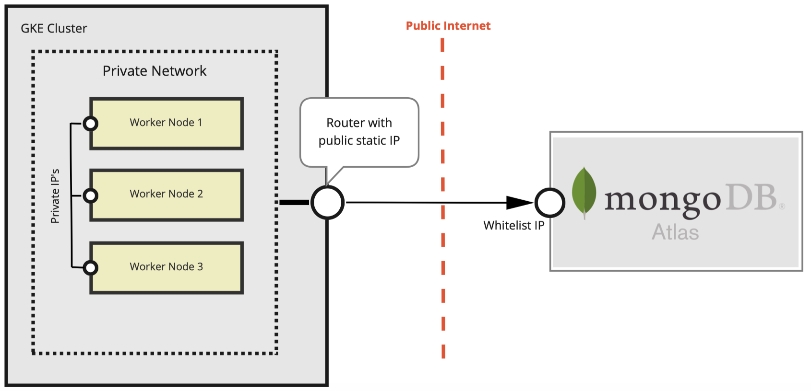

## Preface

In the [previous article](README.md) we showed you how to connect to MongoDB Atlas with Go and interact with the database cluster. MongoDB Atlas is a cloud platform, therefore queries run through the public internet and must be very well secured. Let's go over some of the options we have in terms of security and protection while creating a distributed cloud infrastructure. We'll focus on one particular facility, and that's a connection between a Google Kubernetes cluster and a MongoDB atlas.

## Possible solutions

MongoDB Atlas offers three possibilities to secure the network access:


### IP Access List

You can manage static IP addresses of hosts allowed to connect to your database clusters. This is a very easy way to achieve the goal, especially if you want to connect a single VM (virtual machine) that has a static public IP. One good thing about this way is that you can use this setup with all layers that MongoDB Atlas offers, even the smallest and free `M0 Sandbox`. However, if you have a Kubernetes cluster with multiple nodes, this option is almost useless. First of all, the nodes of the cluster must have public IP addresses - a setup that is usually not preferred for security reasons. Second, the public IP address of a node in the cluster will most likely change at some point, and therefore the MongoDB atlas might start to reject connections from that node.
Why this option is _almost_ useless for Kubernetes clusters, we will explain below.

### Peering

Is very good if you have a cluster to connect. Also quite easy to set up. There is a [comprehensive guide](https://docs.atlas.mongodb.com/security-vpc-peering/) on how to do this. However, you must have at least one `M10` cluster, which is not always what you want to use. For example, we like to use several smaller MongoDB atlas clusters, sometimes only volatile and at a lower price. So even this option does not quite meet our requirements.

### Private Endpoint

Is pretty much the same as `peering`, but was built for AWS and works very well for them.

So, our challenge is to whitelist a Google Kubernetes Engine (GKE) cluster in MongoDB Atlas for `M2`, `M5` or even with a free of charge `M0` tier. MongoDB Atlas doesn't support such possibility out-of-the-box. We have to tinker with the GKE cluster.

## Big Picture

Our goal is to set up the GKE cluster so that it receives an IP address that is public and static. For this we use Cloud NAT:



Accordingly to this picture we are going to do following steps:

1. Create a GKE cluster with private nodes
2. Create a router and connect it with the clusters network
3. Preserve a static ip address and assign it to the router
4. Whitelist this ip address in Mongo DB Atlas in `IP Access List`

## Create a GKE cluster with private nodes

In any case, it is a good idea to keep the IP addresses of your nodes private. For security reasons, we recommend choosing this setup as a best practice. However, for simplicity, we will now make the Kubernetes API endpoint publicly available. First we will authorize `gcloud` to access the cloud platform:

```sh
> gcloud config set project my-project
Updated property [core/project].

> gcloud auth activate-service-account \
    cluster-admin@my-project.iam.gserviceaccount.com \
    --key-file cluster-admin-key.json
Activated service account credentials for: [cluster-admin@my-project.iam.gserviceaccount.com]
```

_Hint: you must have a service account with the roles `Kubernetes Engine Cluster Admin` and `Compute Network Admin` as well as a key file to create a cluster. In our example we named the service account `cluster-admin` and the key `cluster-admin-key.json`_

Let's get the cluster up and running:

```sh
gcloud container clusters create my-cluster \
    --enable-private-nodes \
    --enable-ip-alias \
    --master-ipv4-cidr 172.16.0.0/28 \
    --no-enable-master-authorized-networks \
    --no-enable-basic-auth \
    --no-issue-client-certificate \
    --zone europe-west1-b
```

* `--enable-private-nodes`: All nodes receive private IP addresses and cannot be reached from outside the cluster.
* `--enable-ip-alias`: A VPC-native cluster is created, i.e. subnets with two secondary IP ranges are established: one for pods and one for services
* `--master-ipv4-cidr 172.16.0.0/28`: Specifies an internal address range for the Kubernetes management endpoints. You must declare this range when you start a private cluster.
* `--no-enable-master-authorized-networks`: enable access to the Kubernetes API endpoint from anywhere.
* `--no-enable-basic-auth`: Disables basic authentication for the cluster.
* `--no-issue-client-certificate` disables issuing a client certificate.
* `--zone europe-west1-b`: In which zone should the cluster be created. Be careful when selecting the zone. It should be the same one on which MongoDB Atlas runs, unless you have good reasons to start the cluster somewhere else. Using the same zone shortens the response time of Mongo queries and reduces costs.

If everything worked, you should receive such an output.

```sh
NAME        LOCATION        MASTER_VERSION  MASTER_IP     MACHINE_TYPE   NODE_VERSION    NUM_NODES  STATUS
my-cluster  europe-west1-b  1.15.12-gke.20  35.234.XX.YY  n1-standard-1  1.15.12-gke.20  3          RUNNING
```

## Setting up the router with the static IP

Now we encourage you to go to the [Google Console](https://console.cloud.google.com) and continue with Cloud NAT:


...and click on the button `Create NAT gateway`.


You must fill in the following fields:

* `Gateway name`: As it says, this is the name of your gateway.
* `VPC Network`: Can remain as _default_ until now.
* `Region`: Should be the same where your cluster runs (_europe-west1_ in our case).
* `Cloud Router`: Is not yet created, but we can create it right here by clicking on _Create New Router_.

In the new form you only need to enter a proper name for a router and click on `Create`:


Now you are back on the previous form and your router is already set up. The last step is to create a static IP address for our router. Change the selection of the field `NAT IP addresses` to `manual`, leave the other fields as they are.


Again, in a new form you only need to enter an alias for the static IP address you want to reserve:


After a few seconds your Cloud NAT gateway is ready to serve you!

## Whitelist the IP address on MongoDB Atlas

If you click on the newly created gateway, you will see its configuration in details.


`my-nat-ip` has the IP 34.78.85.15 in our case. This is the one that can be whitelisted under `IP Access List` on MongoDB Atlas.<br>

On the [MongoDB Atlas Console](https://cloud.mongodb.com) go under _Network Access -> IP Access list_ again, click on `Add IP Address` there and put this IP and a comment.<br>

Now your GKE cluster is securely connected to the MongoDB Atlas and you can use database clusters of any setup you want!

## Things to be considered

You can remove the GKE cluster easily by the following command:

```sh
gcloud container clusters delete my-cluster --zone europe-west1-b
```

However, this command does not release the static IP address you reserved earlier. And this is a resource you are paying to Google for. Be careful to remove everything:
- the Cloud NAT
- the router
- the static IP address under _VPC Network -> External IP Addresses_ as the last step

Actually you have to use an infrastructure as code software for this, but there is enough input for today.
