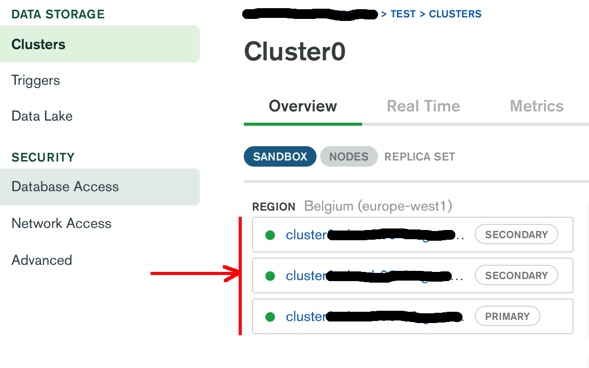

## Preface

They say, Golang is a very good choice, if you build a service for being deployed in the cloud infrastructure. And that is mostly true. However, if you have a stateful service with some database in the backend, you may find it difficult to setup such cloud infrastructure and to establish a communication between the Go service and the database server.

Fortunately, there are solutions already in existence that simplify our life. For example, if you want to have your data stored in MongoDB, you may just use MongoDB Atlas - a fully [managed database service in the cloud](https://www.mongodb.com/cloud/atlas). We do not explain here, how to setup a MongoDB cluster there. It is very well done [here](https://docs.atlas.mongodb.com/getting-started/). We focus on how to create a connection to MongoDB Atlas with Go and interact with the database cluster.

## Software Prerequisites

You need an account on MongoDB Atlas and a running database cluster there. The tier `M0 Sandbox` would be enough, since it is free to use and allows you to store up to 512MB of data.
Please make sure your IP is added to the whitelist in your MongoDB Atlas project (see Security -> Network Access). If you deploy the Go service in a Google Kubernetes Engine, you may want to take a look at our next article, which explains how to securely connect a Kubernetes cluster with the MongoDB Atlas.

## Create an empty Go service

Let us create a simple Go service with two endpoints:

- `/save` to receive a record to store
- `/read` to read the previously stored record

The service will listen at the port `8080`:

```package main

import (
    "net/http"
)

func main() {
    http.HandleFunc("/save", post)
    http.HandleFunc("/read", get)

    if err := http.ListenAndServe(":8080", nil); err != nil {
        panic(err)
    }
}

func post(w http.ResponseWriter, req *http.Request) {}

func get(w http.ResponseWriter, req *http.Request) {}
```

## Create a connection to the MongoDB Atlas cluster

[mgo.v2](https://pkg.go.dev/gopkg.in/mgo.v2) is a very useful package for interacting with Mongo and we are going to use it for the MongoDB Cluster Atlas as well. Add this function at the beginning of your code:

```
func createConnection() (*mgo.Session, error) {
    dialInfo := mgo.DialInfo{
        Addrs:    []string{"abc-shard-00-00.gcp.mongodb.net:27017", "abc-shard-00-01.gcp.mongodb.net:27017", "abc-shard-00-02.gcp.mongodb.net:27017"},
        Username: "MongoUser", // your mongodb user
        Password: "YourVerySecurePassword", // ...and mongodb password
    }
    tlsConfig := &tls.Config{}
    dialInfo.DialServer = func(addr *mgo.ServerAddr) (net.Conn, error) {
        conn, err := tls.Dial("tcp", addr.String(), tlsConfig) // add TLS config
        return conn, err
    }
    return mgo.DialWithInfo(&dialInfo)
}
```

On the MongoDB Atlas you always have not just a single database server, but a cluster with several shards. You have to replace the shard addresses `abc-shard-00-XX.gcp.mongodb.net:27017` with your own ones that are to find here:



We also added a TLS config into our code, because the MongoDB Atlas denies unencrypted connections.

Adding the initialization of the session variable completes the first step:

```
var mongoConn *mgo.Session

func main() {
    var err error
    mongoConn, err = createConnection()
    if err != nil {
        panic(err)
    }

    http.HandleFunc("/save", post)
    http.HandleFunc("/read", get)

    if err := http.ListenAndServe(":8080", nil); err != nil {
        panic(err)
    }
}
```

## Using the mongo connection

What we have now is a singleton `mongoConn` that can be used directly which is not a good idea. Why create it at all? Why cannot we establish a connection every time the client calls our endpoints?

Because `mgo.DialWithInfo(...)` can take several seconds before the connection to the MongoDB Atlas is ready. There is a couple of necessary steps like sending and accepting certificates, authorization etc. that needs to be done, before your service can proceed to the next step.

And of course you cannot use the singleton `mongoConn` in all your endpoints for an obvious reason (due to the side effects by using of a common connection in concurrent HTTP sessions).

So, we use a copy of the singleton `mongoConn` which works quick and safe:

```
    session := mongoConn.Copy() // "session" can be used safely
    defer session.Close()
```

Let us implement `/save` and `/read` now. We store the data in a sort of generic way: everything what the client app sends us we are going to save into the Mongo database as a byte array.

```
type MyEntity struct {
	Data []byte `json:"data" bson:"data"`
}

func post(w http.ResponseWriter, req *http.Request) {
    payload, err := ioutil.ReadAll(req.Body)
    if err != nil {
        panic(err)
    }

    session := mongoConn.Copy()
    defer session.Close()

    entity := MyEntity{Data: payload}
    err = session.DB("test").C("data").Insert(entity)
    if err != nil {
        panic(err)
    }
}

func get(w http.ResponseWriter, req *http.Request) {
    session := mongoConn.Copy()
    defer session.Close()

    entity := MyEntity{}
    err := session.DB("test").C("data").Find(bson.M{}).One(&entity)
    if err != nil {
        panic(err)
    }

    w.Write(entity.Data)
    w.Write([]byte{10}) // add a line break for a better look
}
```

_Normally you would not want to `panic` in case of an error, but return an HTTP error code in the response. However, we want to keep it simple for now._

Do not forget to close a copy of your session. MongoDB Atlas considers sessions as a resource and like every database server has a limit for the amount of opened connections.

We are ready to test our endpoints!

## Testing the endpoints

You can start the service with following command (don't forget a point at the end):

```
> go run main.go .
```

If it worked, you will be able to save your data into the MongoDB Atlas cluster with `curl`:

```
> curl -i -XPOST http://127.0.0.1:8080/save --data 'Here is my record'

HTTP/1.1 200 OK
Date: Fri, 10 Jul 2020 13:03:03 GMT
Content-Length: 0
```

...and fetch this data again via `/read`

```
> curl -i -XGET http://127.0.0.1:8080/read

HTTP/1.1 200 OK
Date: Fri, 10 Jul 2020 13:06:24 GMT
Content-Length: 18
Content-Type: text/plain; charset=utf-8

Here is my record
```

At least, it worked for us.

If you want to download the entire source code of this topic, visit us at [github.com/setlog/go-mongo-atlas](https://github.com/setlog/go-mongo-atlas)

Be nosy and stay connected!
